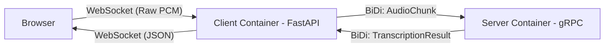

# gRPC Streaming Audio Transcription

This project demonstrates real-time audio streaming from a browser to a gRPC server for transcription (e.g., using OpenAI Whisper).

## Architecture

The system uses a WebSocket to bridge audio from the browser to a gRPC bidirectional stream on the server.

## Audio Troubleshooting Links

- [20 - 20,000 Hz Audio Sweep](https://www.youtube.com/watch?v=PAsMlDptjx8)
- [Online Tone Generator](https://onlinetonegenerator.com/)
- [Musicca Virtual Instruments](https://www.musicca.com/instruments)