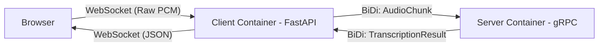
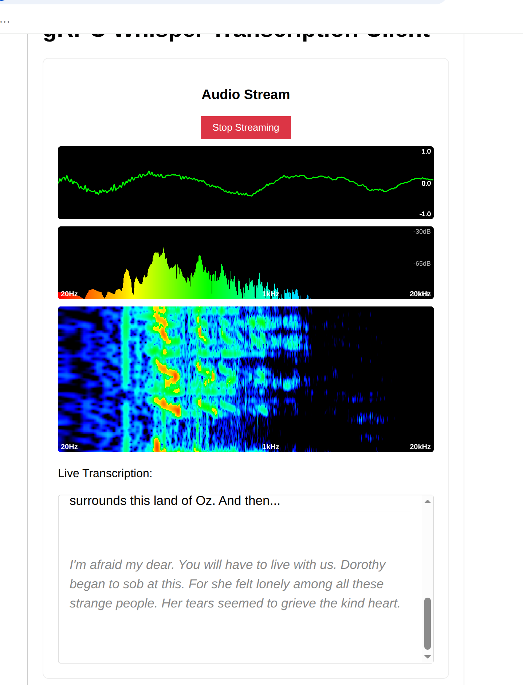

# AI Audio Lab

**Everything Audio: From real-time AI transcription to additive synthesis and music analysis.**

This repository is a comprehensive playground for audio experiments, exploring the intersection of modern AI and classic sound synthesis.

## 🧪 Experiments Overview

### 🎹 Additive Synthesis
Located in `/experiments/additive_synth`

A series of educational scripts exploring how to build complex waveforms from scratch using mathematics and pure sine waves.
- **Wave Types & Aliasing**: Demonstrates the difference between mathematical "perfect" waves (which can sound harsh/aliased) and band-limited waves built via additive synthesis.
- **Envelopes**: Implementation of ADSR (Attack, Decay, Sustain, Release) and other amplitude envelopes to shape sound.
- **Noise Generation**: Custom implementations for generating White, Pink, and Brown noise.
- **Intervals**: Exploration of musical intervals and tuning.

### 🗣️ Text-to-Speech (TTS)
Located in `/experiments/text_to_speech`

Experiments with modern, open-source TTS models for generating high-quality speech.
- **Coqui TTS**: Scripts for generating speech using VITS and XTTS v2 models.
- **Kokoro 82M**: Experiments with this lightweight, high-quality model, including voice blending and weighted blending techniques.

### 🎼 Music Analysis (Basic Pitch)
Located in `/experiments/basic-pitch`

Audio-to-MIDI conversion experiments using Spotify's **Basic Pitch**.
- **Inference**: converting raw audio files into MIDI sequences.
- **Playback**: Scripts to play back the analyzed results.
- **Comparison**: Includes references to original audio and the resulting MIDI analysis for quality comparison.

### 🎤 Real-time Transcription
Located in `/server` and `/client`

The project's original core functionality.
- **Browser-to-Server Streaming**: WebSocket-based audio capture from the browser.
- **gRPC Backend**: Python server handling the audio stream and performing transcription using OpenAI's Whisper model.
- **Bidirectional Streaming**: Real-time feedback loop sending transcription results back to the client as they happen.

---

## 🎙️ Featured: gRPC Streaming Audio Transcription

The original core of this project demonstrates real-time audio streaming from a browser to a gRPC server for transcription.

**Recorded Demo:** [Watch on YouTube](https://youtu.be/2xyq0HK2D14)

### Architecture

The system bridges browser audio (WebSocket) to a backend gRPC stream.





---

## 🛠️ Audio Tools & Troubleshooting

Helpful resources for debugging audio input/output issues on Linux.

### Quick Commands
```bash
# Check input devices
arecord -l

# Update and install audio utilities
sudo apt update
sudo apt install pavucontrol alsa-utils

# Check PulseAudio/PipeWire status
systemctl --user status pipewire pipewire-pulse wireplumber
```

### 📚 Resources & Libraries

**Python Audio & Signal Processing**
- [Pydub](https://github.com/jiaaro/pydub) - Simple and easy high-level interface for manipulating audio.
- [Librosa](https://github.com/librosa/librosa) - The gold standard for audio and music analysis in Python.
- [Spotify Pedalboard](https://github.com/spotify/pedalboard) - High-quality, studio-grade audio effects in Python.

**AI Models & Frameworks**
- [OpenAI Whisper](https://github.com/openai/whisper) - General-purpose speech recognition model.
- [Coqui TTS](https://github.com/coqui-ai/TTS) - Deep learning toolkit for Text-to-Speech, offering high-performance models.
- [Kokoro ONNX](https://github.com/thewh1teagle/kokoro-onnx) & [HuggingFace Reference](https://huggingface.co/spaces/hexgrad/Kokoro-TTS) - Lightweight and fast TTS model implementations.
- [Magenta](https://github.com/magenta/magenta) - Research project exploring the role of machine learning in the process of creating art and music.

**Music Information Retrieval**
- [Basic Pitch](https://github.com/spotify/basic-pitch) - A lightweight yet robust audio-to-MIDI converter.
- [Signal MIDI](https://signalmidi.app/?lang=en) - A capable web-based MIDI editor for visualizing and editing MIDI files.

**Learning**
- [The Sound of AI (Valerio Velardo)](https://www.youtube.com/c/ValerioVelardoTheSoundofAI) - Excellent channel for learning AI audio, DSP, and Deep Learning for audio.
- [Mike Russell](https://www.youtube.com/@MikeRussell) - Professional audio production tips and tutorials.
- [Audacity](https://www.audacityteam.org/) - Audio editing and analysis
- [20 - 20,000 Hz Audio Sweep](https://www.youtube.com/watch?v=PAsMlDptjx8) - Test frequency response for web audio, using spectrogram.
- [Online Tone Generator](https://onlinetonegenerator.com/) - Generate reference tones
- [Musicca Virtual Instruments](https://www.musicca.com/instruments) - Test MIDI/Synthesis
